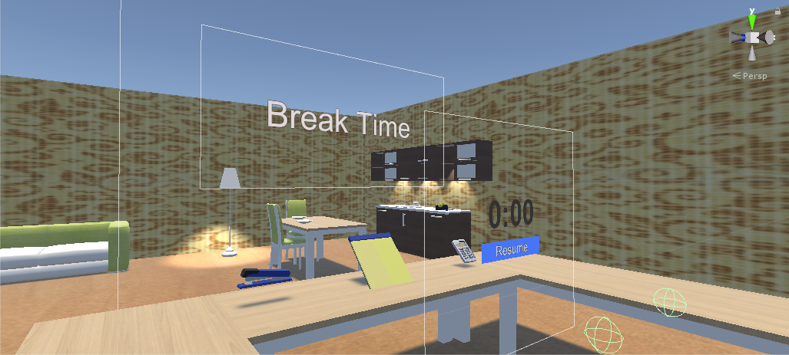

# Event Related Potentials for Virtual Reality Interactions

This Unity project contains a testing environment for collecting EEG
data via LSL while the participant is immersed in the VR
environment.

## Testing Check List

The following are the instructions I used when collecting data using
an HTC Vive headset and a BrainProducts Acticap/V-amp with dry
electrodes.

### HTC Vive Setup
1. Follow normal HTC vive set hardware setup
2. For my tests, since participants were seated, I configured steamVR for standing-only

### EEG Setup and LSL Check
1. Plug in the VAmp to the computer via USB
2. Start the Vamp.exe LabStreamingLayer application
3. Check that the app has all the options you want selected (default selections should be fine)
4. Click Link
5. Now, within Unity you while the game is playing, you should be able to connect to LSL under the options menu.

### Sound Check
1. The '1', '2', and '3' keys all map to sounds and can be used to test the stimuli volue prior to starting tests
2. Always check to make sure that sounds are not too loud and that participants are comfortable

## Experimenter Script

The script for briefing the participant on their task can be found
in the experimenter_script.txt file

### EEG Channels
This is the channel configuration I used with the BrainVision Acticap Express and V-Amp hardware.

| Channel # | Cap Position | 10-20 Positiion |
|:---------:|:------------:|:---------------:|
|     1     |      29      |       Fp1       |
|     2     |      --      |        F3       |
|     3     |      17      |        Cz       |
|     4     |      13      |        Cp1      |
|     5     |      11      |        P3       |
|     6     |       7      |        Pz       |
|     7     |      --      |       Po3       |
|     8     |       3      |        O1       |
|     9     |      30      |       Fp2       |
|     10    |      --      |        F4       |
|     11    |      12      |       Cpz       |
|     12    |      14      |       Cp2       |
|     13    |      10      |        P4       |
|     14    |       4      |       Poz       |
|     15    |      --      |       Po4       |
|     16    |       2      |        O2       |

## Warnings:
* When developing or testing on a non VR capable computer,
  ignore errors related to 'XR' or 'OpenVR'. Scenes that do
  not contain VR specific assets should still be able to run
  without problems.